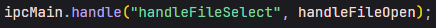
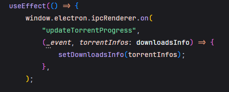

# Contributor's Guide
Project Folder's Structure follow these patterns:
- src/main > Back-End Files
- src/preload > Exposes Back-End To Front-End
- src/renderer > Front-End Files

## Back-End (@main)
As Greed is built over Electron, it uses a isolated environment model that uses differents IPC's who stands for Inter-Process Communication as IpcMain and IpcRenderer, these channels are used to receive and send data over the entire Application. At the final, these IPC's are nothing more than interfaces that mounts over NodeJS, Greed specifically uses Node's event-loop to make the entire communication over the processes like: 

In this example the ipcMain object is expecting until an event is emitted at the chosen channel, which is "handleFileSelect" in this specific example, after receiving some emit, it trigger the chosen function to handle the incoming data, in this case, handleFileOpen();

### Database
* Greed uses SQLite3 Database managed by TypeORM, entities can be found in src/entity.
* 
* There are a huge open issue to remove completly steam-games.json (src/steam-games.json) file dependency from the project; It is huge to pack (~12MB) making even Vite's Hot Module Reloader to reload changes slower, the idea is to be completly independent from it, using only database loaded games (remove it from workers files, once it is where it is needed for package, what increases the package/HMR load).

**NOTE** Scrapping new games is still an to-be-added feature, See: [Open Issue](https://github.com/wnccys/greed-client/issues/38).

### Merge Algorithm
* First time user open the app, an algorithm is responsible for setting up all objects in steam-games.json to using WorkerDB (See [Vite Static Assets](https://v3.vitejs.dev/guide/features.html#static-assets), [Vite Workers](https://v3.vitejs.dev/guide/features.html#static-assets)); After a source is added, a merge algorithm is called, making the match into steam games and source games, It uses arbitrary parameters (**TO-BE-ENHANCED**) to make it work. 

### CI/CD
There are currently 3 Workflows set for this project:
 * Formatter: Check for correct Biome code format.
 * General Tests: Currently the tests code coverage are pretty low.
 * Packager: Build App (currently only Windows).

## Preload (@preload)
Files that exposes functions from main to renderer throught an event-based architecture, where one listens and react's when other's data comes. The basic is that, a function exposed to front-end needs to be typed as we are using Typescript, these types are declared at index.d.ts in the preload folder like:    

 It tells Typescript to make resumeTorrent() available to Front-End and makes it possible to be called there properly.

## Front-End (@renderer)
Rendered pages receives data from Back-End using React and updates it's data, for example: 

 In this example, React's useEffect awaits for a message from the channel "updateTorrentProgress" that on change assigns to a component useState, causing the component to update it's data.

* There are an open issue to move all fetch request to ReactQuery, See [Open Issue](https://github.com/wnccys/greed-client/issues/34).