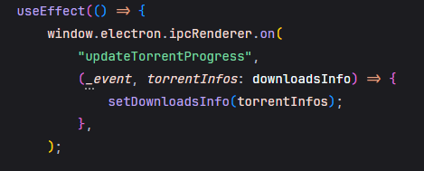

# Guia do contribuidor
A estrutura das pastas do projeto segue os seguintes padrões:
- src/main > Arquivos de Back-End
- src/preload > Expõe o Back-End para o Front-End
- src/renderer > Arquivos de Front-End

### Back-End (@main)
Como o Greed é construído sobre Electron, ele utiliza um modelo de ambiente isolado que usa diferentes IPCs (Inter-Process Communication), como IpcMain e IpcRenderer. Esses canais são usados para receber e enviar dados em toda a aplicação. No final, esses IPCs nada mais são do que interfaces que se montam sobre o NodeJS. O Greed, especificamente, utiliza o event-loop do Node para realizar toda a comunicação entre os processos, como no exemplo abaixo: 

 Neste exemplo, o objeto ipcMain fica aguardando até que um evento seja emitido no canal escolhido, que, neste caso, é "handleFileSelect". Após receber a emissão, ele aciona a função escolhida para manipular os dados recebidos, que neste caso é a função handleFileOpen().

### Preload (@preload)
Arquivos que expõem funções do back-end para o front-end através de uma arquitetura baseada em eventos, onde uma função escuta e reage quando os dados de outra chegam. O básico é que uma função exposta ao front-end precisa ser tipada, já que estamos usando Typescript. Esses tipos são declarados no arquivo index.d.ts na pasta preload, como mostrado no exemplo abaixo:   

 Isso informa ao Typescript que a função resumeTorrent() está disponível para o front-end e pode ser chamada corretamente.

### Front-End (@renderer)
As páginas renderizadas recebem dados do back-end usando React e atualizam suas informações, como no exemplo abaixo: 

Neste exemplo, o hook useEffect do React aguarda uma mensagem do canal "updateTorrentProgress" que, ao mudar, é atribuída ao useState de um componente, fazendo com que o componente atualize seus dados.
