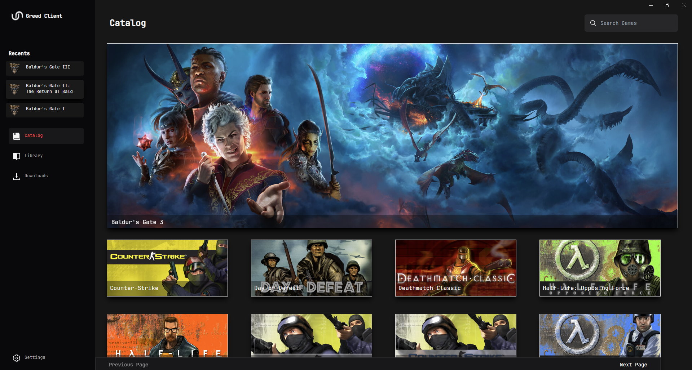

[](https://github.com/wnccys/greed-client/actions/workflows/general_tests.yml)

<div align="center">

  

  <h1>Greed-Client</h1>

  <br>

  

</div>

## What Is It?

Greed is a game launcher that features it's own embedded BitTorrent client and a dynamic torrent source scrapper; The main project's goal is to be the most *decentralized*, *transparent*, *distributed* and *cheap* as possible. It's written in Typescript built over Electron, allowing users to use the launcher locally without any external central server.

## Contributor's Guide

See [How to Contribute](./CONTRIBUTORS.md)

## Project Setup

### Install Dependencies

```bash
$ npm install
```

### Development

```bash
$ npm run dev
```

### Build

```bash
# For windows
$ npm run build:win

# For macOS
$ npm run build:mac

# For Linux
$ npm run build:linux
```

## License
Greed is under the MIT License, which grants the right to copy, modify, and distribute the software, as long as the original copyright notice and this permission notice are included in all copies or substantial portions of the software.


## Honorable Mentions

[Hydra Launcher](https://github.com/hydralauncher/hydra) </br>
[Hydra Links](https://hydralinks.cloud/sources/fitgirl.json) </br>
[Steam DB Info](https://steamdb.info/) </br>
